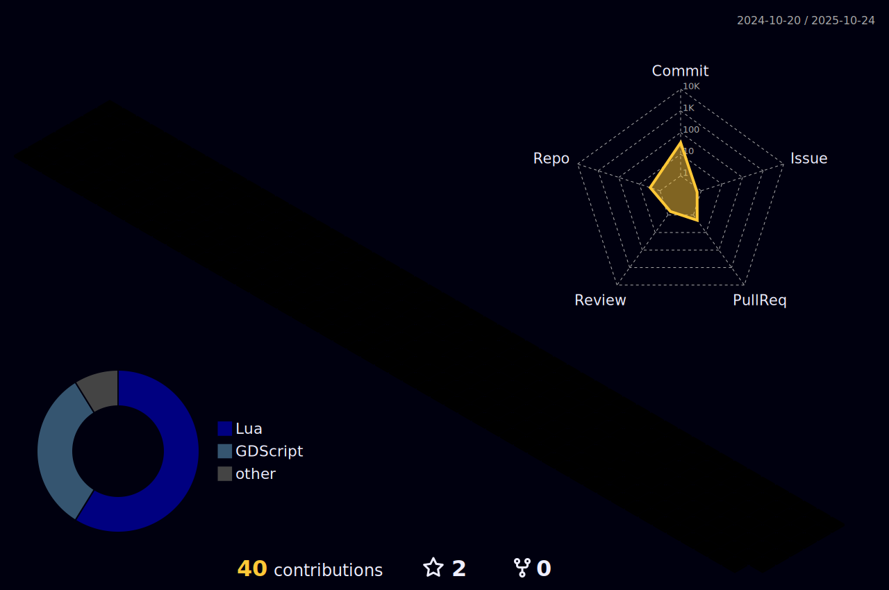

## About Me:
Hello, my name is Cadence, I am a Fullstack Programmer and UI/UX Designer I work on a variety of projects from Roblox, ML, Web and more
I currently am working on some experimental projects to flesh out my portfolio
 

## Github Stats:

<!---

                            

 
 
